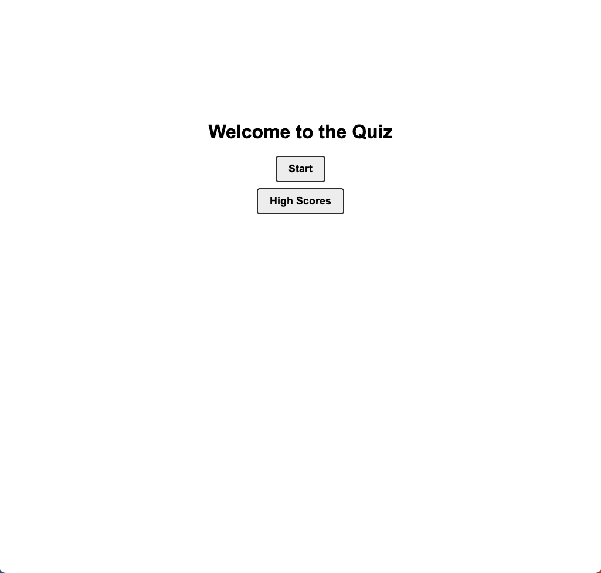

# Welcome to Study Guide 👋

> A quiz app using Javascript, HTML and CSS

### ✨ [Demo](https://therealplanz.github.io/Study-Guide/)

## Screenshot

## Author

👤 **Zachary Levin**

* Twitter: [@TheRealPlanZ](https://twitter.com/TheRealPlanZ)
* Github: [@TheRealPlanZ](https://github.com/TheRealPlanZ)

## Show your support

Give a ⭐️ if this project helped you!

***
_This README was generated with ❤️ by [readme-md-generator](https://github.com/kefranabg/readme-md-generator)_